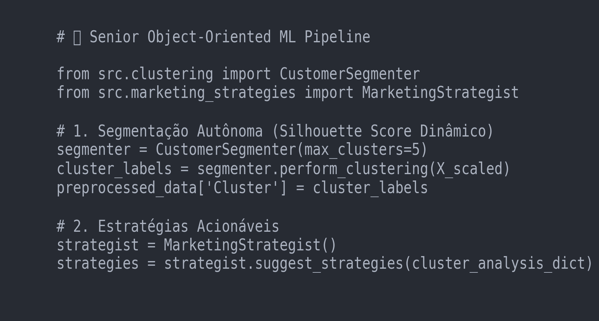

# Triggo Case Study




Technical case built for the Triggo trainee process, framed as a production-minded analytics artifact rather than a one-off notebook. The project combines customer segmentation, clustering evaluation, testing, logging, and business interpretation over the Olist e-commerce dataset.

## Executive Summary

This repository shows how a machine learning exercise can be elevated into a stronger portfolio case by adding:

- a structured data-preparation flow
- silhouette-driven cluster selection instead of arbitrary segmentation
- test coverage for key analytical behaviors
- logging and error-handling discipline
- a business layer that translates model output into actionable customer strategies

The result is not just clustering. It is a more mature analytical narrative that connects engineering discipline to marketing and commercial decision support.

## Business Problem

The challenge was to extract useful customer segments from a large transactional dataset while preserving explainability and business relevance. The solution needed to go beyond exploratory analysis and demonstrate a path from raw data to segmentation logic that could support retention, activation, and upsell decisions.

## What Was Built

### 1. Data Preparation Layer

The pipeline profiles and prepares Olist data for segmentation, with reusable preprocessing logic and centralized scaling behavior.

### 2. Clustering Layer

Customer groups are evaluated through silhouette-score-driven logic, making the segmentation more defensible than choosing a fixed number of clusters by intuition.

### 3. Operational Hardening

The project includes Pytest coverage and logging so the workflow is easier to validate, reuse, and trust.

### 4. Business Translation

The final notebook/dashboard turns technical segmentation output into a more executive-facing story with customer behavior interpretation and next-action framing.

## Repository Structure

```text
case-triggo/
├── customer-segmentation/
│   ├── src/
│   │   ├── analysis.py
│   │   ├── clustering.py
│   │   ├── data_preprocessing.py
│   │   ├── logger.py
│   │   ├── marketing_strategies.py
│   │   └── utils.py
│   ├── tests/
│   └── README.md
├── data/
├── notebooks/
├── tests/
├── customer_segmentation.ipynb
├── dashboard.ipynb
├── dashboard_demo.gif
├── evolucao_vendas.png
└── requirements.txt
```

## Technical Highlights

- `CustomerDataProcessor` centralizes preprocessing and scaling behavior
- `CustomerSegmenter` evaluates clustering quality with silhouette logic
- `MarketingStrategist` converts cluster interpretation into business actions
- `pytest` validates preprocessing, clustering, and marketing logic
- notebooks keep the presentation layer separate from the reusable codebase

## Key Signals

- Dynamic cluster selection instead of fixed segmentation
- Test-driven analytical workflow
- Logging and error handling for stronger reproducibility
- Business-ready interpretation of ML output

## How To Run

### 1. Create and activate a virtual environment

```bash
python -m venv venv
venv\Scripts\activate
```

### 2. Install dependencies

```bash
pip install -r requirements.txt
```

### 3. Run tests

```bash
pytest customer-segmentation/tests/
```

### 4. Open the analytical notebooks

```bash
jupyter notebook customer_segmentation.ipynb
jupyter notebook dashboard.ipynb
```

## Portfolio Relevance

This case is useful in a portfolio because it demonstrates more than modeling accuracy. It shows judgment around analytical framing, code organization, validation, and business translation, which is what makes a data project feel closer to real production work.

## Author

**Diego Pablo**

- Portfolio: [diego-pablo.vercel.app](https://diego-pablo.vercel.app/)
- LinkedIn: [linkedin.com/in/diego-pablo](https://www.linkedin.com/in/diego-pablo/)
