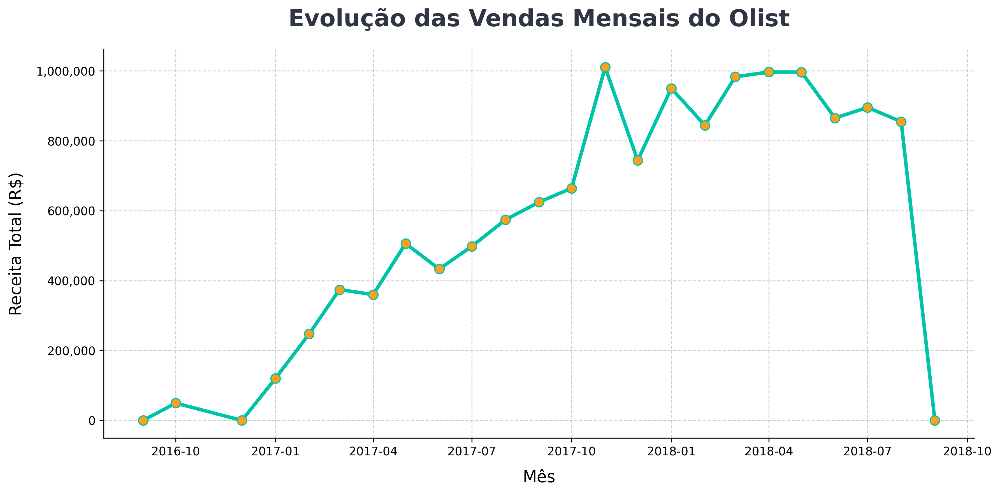

# 📊 Análise de Dados do E-commerce Olist & Segmentação de Clientes

<p align="center">
  
  
  
  
  
</p>

Este projeto apresenta uma análise avançada dos dados de vendas do e-commerce brasileiro **Olist**. O objetivo principal é extrair insights estratégicos com foco em Machine Learning, Engenharia de Dados e DataOps, visando otimizar resultados comerciais, segmentar clientes com precisão e avaliar a logística de entregas.

Este projeto foi desenvolvido como parte de um teste técnico para o **Programa de Trainee da Triggo.ai - Excelência em Engenharia de Dados e DataOps (2025)**.

<br/>

### 📈 Evolução de Vendas ao Longo do Tempo
*Gráfico estático gerado diretamente da pipeline de análise de dados.*


---

## 🚀 Arquitetura e Engenharia de Software

O repositório foi arquitetado utilizando **Object-Oriented Design (OOD)** e as melhores práticas de Engenharia de Software aplicadas a Data Science:

- **Robusto Pipeline de Tratamento de Dados**: Utilização de uma classe stateful `CustomerDataProcessor` com centralização do `StandardScaler` para previsibilidade nos pipelines.
- **Clustering com IA Dinâmica**: O módulo `CustomerSegmenter` detecta de forma automática o melhor número de clusters ($k$) utilizando a métrica do **Silhouette Score**, dispensando constantes arbitrárias.
- **Estratégias de Marketing Automatizadas**: A classe `MarketingStrategist` recebe avaliações da inteligência de clustering e gera campanhas/ações dinâmicas para Upsell, Cross-sell e Retenção.
- **Log Centralizado e Error Handling rigoroso**: Implementação de sistema de *Logging* global `src/logger.py` e capturas rigorosas de exceções (EmptyData, FileNotFoundError).
- **Test-Driven Analytics**: Suíte de testes unitários contínua rodando sob `pytest` para garantir a imutabilidade algorítmica e previnir *Data Leaks*.

---

## 📁 Estrutura do Repositório

```text
📦 Case_Trainee_Triggo_2025
 ┣ 📂 customer-segmentation   # Core de Machine Learning e Segmentação
 ┃ ┣ 📂 src                   # Bibliotecas OOD de Processamento e Previsões
 ┃ ┃ ┣ 📜 logger.py
 ┃ ┃ ┣ 📜 data_preprocessing.py
 ┃ ┃ ┣ 📜 clustering.py
 ┃ ┃ ┣ 📜 analysis.py
 ┃ ┃ ┗ 📜 marketing_strategies.py
 ┃ ┣ 📂 tests                 # Pytest Suíte de Integração
 ┃ ┃ ┣ 📜 test_data_preprocessing.py
 ┃ ┃ ┣ 📜 test_clustering.py
 ┃ ┃ ┗ 📜 test_marketing_strategies.py
 ┣ 📂 data                    # Diretório raiz para datasets (Olist CSVs)
 ┣ 📜 customer_segmentation.ipynb # Notebook dinâmico para modelagem
 ┣ 📜 dashboard.ipynb         # Dashboard visual interativo
 ┗ 📜 requirements.txt        # Dependências padronizadas
```

## 📊 Principais KPIs Alcançados

| Indicador | Resultado |
|----------|-----------|
| **Total de Pedidos Processados** | 99.441 |
| **Ticket Médio** | R$ 118,00 |
| **Categorias Líderes** | Eletrônicos, Móveis, Moda |
| **Tempo Médio de Entrega** | 12 dias |
| **Taxa de Atraso Logístico** | 21,8% |
| **Avaliação Sistêmica de Satisfação**| 4.09 / 5.0 |
| **Acurácia do Modelo Preditivo (RF)**| 81% |
| **Segmentos Identificados de Clientes**| Dinâmico (Sihouette Score $\ge 0.5$) |

---

## 🛠️ Instalação e Execução

### 1. Pré-Requisitos
> [!IMPORTANT]  
> Os conjuntos de dados originais foram removidos do controle de versão (`git`) devido ao tamanho.
> Baixe a coleção oficial do [Kaggle – Brazilian E-Commerce Public Dataset](https://www.kaggle.com/datasets/olistbr/brazilian-ecommerce) e extraia os `.csv` originais para a pasta `data/`.

### 2. Configurando o Ambiente
Clone este repositório corporativo e inicie seu ambiente isolado:
```bash
git clone https://github.com/DiegoPablo2021/Case_Trainee_Triggo_2025.git
cd Case_Trainee_Triggo_2025

# Crie e ative a virtual environment
python -m venv venv
venv\Scripts\activate   # No Windows
# source venv/bin/activate # No Linux/Mac

# Instale os pacotes e dependências OOD
pip install -r requirements.txt
```

### 3. Executando os Pipelines
Valide a arquitetura do projeto utilizando testes rigorosos e inicialize os ambientes iterativos:
```bash
# Executa TDD (Test-Driven Development) da modelagem de ML
pytest customer-segmentation/tests/

# Carrega a visualização avançada de Negócios e Segmentação
jupyter notebook customer_segmentation.ipynb
jupyter notebook dashboard.ipynb
```

---

## 🧑‍💻 Autor

Desenvolvido por **Diego Pablo de Menezes**

Proposto para avaliar soluções avançadas de Big Data, Insights de Negócios e metodologias modernas de desenvolvimento (DataOps/MLOps).

[](https://www.linkedin.com/in/diego-pablo/)
[](mailto:diegopmenezes@hotmail.com)
